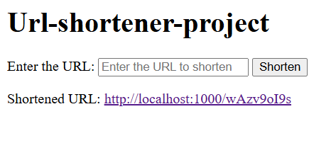
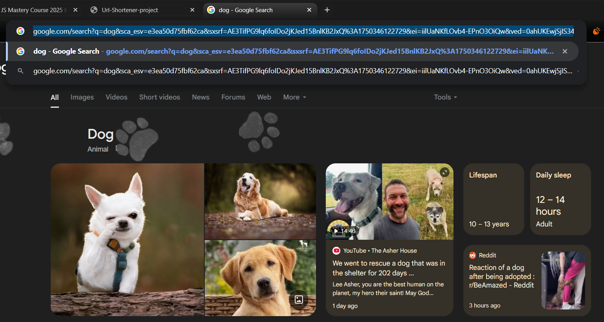
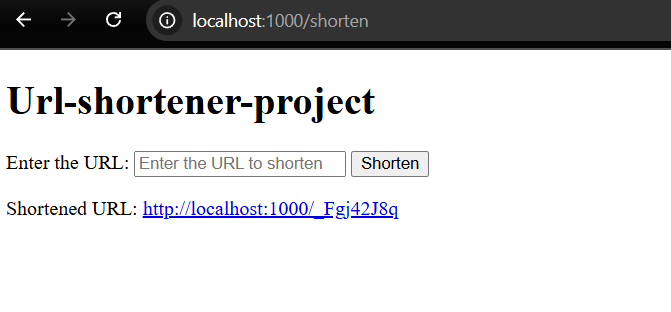
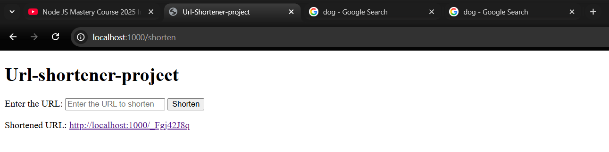

# REST API URL Shortener


> **Tech Stack:** Node.js, Express, MongoDB, EJS

---

## 🚀 Project Overview

This REST API URL Shortener demonstrates how to transform long URLs into concise, shareable links, with seamless redirection—all for learning purposes.

1. **Homepage Overview:**  
    *Explore the simple and intuitive interface for shortening URLs.*  
    

2. **Copying the Original URL:**  
    *Copy any lengthy URL you want to shorten using the provided input field.*  
    

3. **Short URL Generation:**  
    *Generate a unique, shortened URL with a single click.*  
    

4. **Redirection in Action:**  
    *Accessing the short URL instantly redirects you to the original page.*  
    

Each step is designed to illustrate the core functionality and user experience of the URL shortener.

---

## 🛠️ How I Built the Project

1. **Project Setup:** Initialized Node.js, installed dependencies, and structured folders for controllers, models, and views.
2. **Backend:** Set up Express server, connected MongoDB with Mongoose, and created models for storing URLs.
3. **API & Routing:** Built RESTful endpoints for shortening and redirecting URLs.
4. **Frontend:** Used EJS templates to render forms and display results.
5. **Testing:** Manually tested endpoints and redirection logic.

---

## 💡 What I Learned About Backend Development

- **RESTful API Design:** Structuring endpoints for resource management.
- **Express Middleware:** Handling requests, responses, and errors.
- **Database Integration:** CRUD operations with Mongoose and MongoDB.
- **MVC Pattern:** Organizing code for maintainability.
- **Dynamic Routing:** Implementing URL-based logic and redirects.
- **Templating:** Rendering dynamic content with EJS.
- **Error Handling:** Managing invalid input and server errors.

---

## 🏃‍♂️ Running the Project

1. **Clone the repository:**
    ```sh
    git clone <repository-url>
    cd RestApi-url-shortener
    ```

2. **Install dependencies:**
    ```sh
    npm install
    ```

3. **Start the server:**
    ```sh
    npm start
    ```

4. **Open the app:**
    Visit [http://localhost:1000](http://localhost:1000) in your browser.

---

This project deepened my understanding of backend development, from server setup to database integration and dynamic content rendering.
